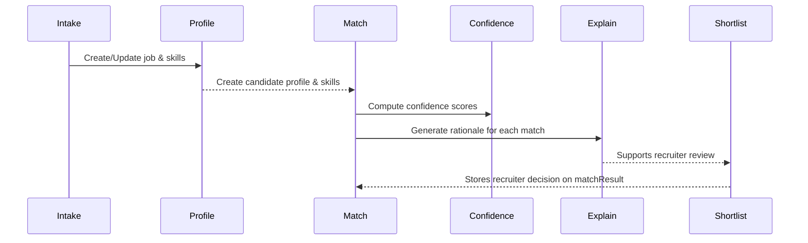

# Agents MVP Cheatsheet

This doc summarizes the current agents and how they are wired in the MVP pipeline.

## INTAKE (Job parser)
- **Purpose:** Normalize raw job descriptions into a structured job profile (title, location, employment type, seniority, status, skills).
- **Endpoint:** `POST /api/agents/intake`
- **Request:** `{ jobReqId?: string, rawDescription?: string, rawJobText?: string }` (`rawDescription` or `rawJobText` required).
- **Response:** Structured job profile `{ title, location?, employmentType?, seniorityLevel?, status?, skills: [{ name, normalizedName?, required? }] }`.
- **Key tables:** `agentRunLog` (run metadata), `jobReq` (created/updated), `jobSkill` (replaced on update).
- **Known limitations / future work:** Requires recruiter/admin role; truncates input to 4000 chars for logging; no streaming; errors if `jobReqId` is invalid.

## PROFILE (Resume parser / RINA)
- **Purpose:** Parse a candidate resume into a normalized candidate profile.
- **Endpoint:** `POST /api/agents/profile` (delegates to RINA).
- **Request:** `{ rawResumeText: string, sourceType?: string, sourceTag?: string }`.
- **Response:** `{ candidateId, agentRunId }` with details logged in agent run; candidate record persisted with parsed fields and `skills` entries.
- **Key tables:** `candidate`, `candidateSkill`, `agentRun` (via RINA helper).
- **Known limitations / future work:** Max resume length 16k; enforces recruiter/admin role; killswitch guarded; input snapshot trimmed to 4000 chars; recruiterId in payload ignored (uses current user).

## MATCH (Deterministic scorer)
- **Purpose:** Score candidate(s) against a job using deterministic signals and produce match records.
- **Endpoint:** `POST /api/agents/match`
- **Request:** `{ jobReqId: string, candidateIds?: string[], limit?: number }` (`limit` defaults to 50 when candidateIds omitted).
- **Response:** List of saved match results and matches with scores, confidence category/reasons, deterministic breakdown, and generated explanation text.
- **Key tables:** Reads `jobReq`, `candidate`, `jobSkill`, `candidateSkill`; writes `agentRunLog`, `matchResult`, `match`, `jobCandidate`, updates outreach counts.
- **Known limitations / future work:** LLM explanations are best-effort (fallback text on failure); requires recruiter/admin and feature flag; killswitch guarded; pulls most recent candidates when `candidateIds` not provided.

## CONFIDENCE (Deterministic confidence helper)
- **Purpose:** Compute confidence category/reasons for a job–candidate pair (data completeness + skill coverage).
- **Endpoint:** No standalone API; invoked inside MATCH via `computeMatchConfidence`.
- **Request/Response shape:** Accepts candidate and jobReq with skills; returns `{ score, category: HIGH|MEDIUM|LOW, reasons: string[], breakdown }`.
- **Key tables:** Uses in-memory candidate/job data already loaded by MATCH (no direct DB writes).
- **Known limitations / future work:** Thresholds fixed at 75/50 splits; recency is based on candidate updatedAt/createdAt only; could be surfaced as its own API if needed.

## EXPLAIN (LLM justification)
- **Purpose:** Generate a recruiter-facing explanation for an existing match.
- **Endpoint:** `POST /api/agents/explain`
- **Request:** `{ matchId?: string, candidateMatchId?: string }` (exactly one required).
- **Response:** `{ explanation, agentRunId }` where `explanation` contains deterministic JSON fields (topReasons, riskAreas, skillOverlapMap, etc.).
- **Key tables:** Reads `match`/`candidateMatch`, related `jobReq`/`job` and skills; writes `agentRunLog`.
- **Known limitations / future work:** Requires recruiter/admin; feature flags + tenant scoping enforced; uses LLM and may fall back to parsing raw text when JSON fails; respects killswitch via shared middleware.

## SHORTLIST (Manual decision capture)
- **Purpose:** Persist shortlist decisions on match results.
- **Endpoint:** `POST /api/agents/shortlist`
- **Request:** `{ matchId: string, shortlisted: boolean, reason?: string | null }` (reason max 500 chars).
- **Response:** `{ id, shortlisted, shortlistReason, candidateId, jobReqId }`.
- **Key tables:** `matchResult` (updates shortlist fields).
- **Known limitations / future work:** Requires recruiter/admin; enforces tenant ownership; no audit trail beyond the field updates.

## Pipeline overview

## LLM safety expectations for agents
- Do not send raw resumes, recruiter notes, or contact details to the LLM; rely on the gateway redaction pipeline instead of embedding full text.
- Route any agent prompt construction through `callLLM` so `SafeLLMContext`, redaction, and size limits apply (no direct provider calls).
- If a new field is needed for prompting, add it to the allowlisted context first. See [LLM data handling & privacy guardrails](./security/llm-guardrails.md) for the canonical rules.
