# EAT API Overview & Responsibilities

## Purpose
This document provides a shared mental model of the EAT API surface so contributors can reason about boundaries and responsibilities.
It is not an exhaustive list of endpoints.
The intended audience is developers, AI agents (Codex), and future maintainers.
This document explains where responsibilities live and how APIs are categorized, not how each endpoint is implemented.

## High-Level API Map

```mermaid
flowchart TB
  A[Next.js App Router] --> B[src/app/api/*]

  B --> ADM[admin/*]
  B --> AG[agents/*]
  B --> ATS[ats/*]
  B --> AUTH[auth/*]
  B --> CANDS[candidates/*]
  B --> CRON[cron/*]
  B --> DS[decision-stream/*]
  B --> ETE[ete/*]
  B --> FF[feature-flags/*]
  B --> HLTH[health/*]
  B --> JC[job-candidate/*]
  B --> JOBS[jobs/*]
  B --> MATCH[match/*]
  B --> MFB[match-feedback/*]
  B --> METRICS[metrics/*]
  B --> OPS[ops/*]
  B --> SYSSTATE[system-state/*]
  B --> SYSSTATUS[system-status/*]
  B --> TENANT[tenant/*]
  B --> UPLOAD[upload/*]

  ADM --> ADM_DESC[Platform admin & governance]
  TENANT --> TEN_DESC[Tenant context & configuration]
  FF --> FF_DESC[Feature flag control]
  OPS --> OPS_DESC[Operational controls]
  METRICS --> MET_DESC[Telemetry & reporting]
  SYSSTATE --> STATE_DESC[Internal system snapshot]
  SYSSTATUS --> STATUS_DESC[System health-style status]
  HLTH --> HEALTH_DESC[Liveness & readiness]

  ATS --> ATS_DESC[ATS sync & connectors]
  JOBS --> JOB_DESC[Job data & workflows]
  CANDS --> CAND_DESC[Candidate data]
  JC --> JC_DESC[Job-candidate lifecycle]

  AG --> AG_DESC[Agent runtime endpoints]
  MATCH --> MATCH_DESC[Legacy agent-style match endpoint]
  MFB --> MFB_DESC[Match feedback loop]
  DS --> DS_DESC[Decision/audit stream]
  ETE --> ETE_DESC[Forecasts & market intelligence]

  CRON --> CRON_DESC[Scheduled jobs]
  UPLOAD --> UP_DESC[Upload & ingestion]
```

## API Lanes
1. **Agent Runtime APIs** — Intelligent workflows such as match, explain, shortlist, and confidence scoring. Examples: `/api/agents/*`, `/api/match`, `/api/decision-stream`.
2. **Domain / Data APIs** — Business entities and workflows. Examples: `/api/jobs`, `/api/candidates`, `/api/job-candidate`, `/api/ats`.
3. **Platform / Control Plane APIs** — Administration, configuration, operations, and system state. Examples: `/api/admin`, `/api/tenant`, `/api/feature-flags`, `/api/system-state`, `/api/ops`.
4. **UI Pages (Non-API)** — Routes under `src/app/*` that render pages. Examples: `/admin`, `/agents`. These should only call APIs and must not embed core logic.

## Design Rules
- Every new API route must clearly belong to one lane.
- Agent intelligence must not live inside domain CRUD APIs.
- Platform APIs require stricter authorization than agent or domain APIs.
- UI routes must not bypass API boundaries.
- Legacy endpoints are allowed but must be documented as such.

## Legacy & Transitional Notes
- `/api/match` exists as a legacy agent-style endpoint.
- The forward direction is a canonical `/api/agents/{agent}/run` pattern.
- No refactor is required by this document; it is descriptive, not prescriptive.
