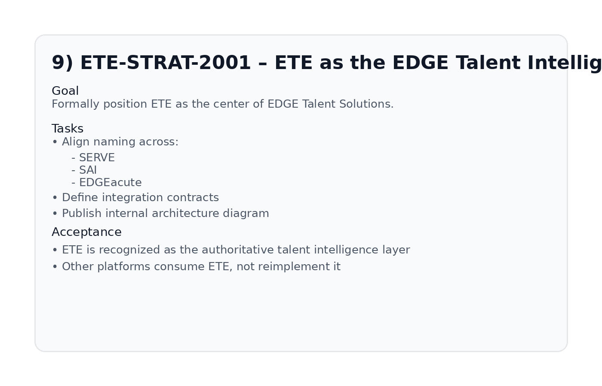

# ETE-STRAT-2001 – ETE as the EDGE Talent Intelligence Core

## Figure

## Goal

Formally position ETE as the center of EDGE Talent Solutions.

## Tasks

- Align naming across:
  - SERVE
  - SAI
  - EDGEacute
- Define integration contracts
- Publish internal architecture diagram

## Acceptance

- ETE is recognized as the authoritative talent intelligence layer.
- Other platforms consume ETE, not reimplement it.
